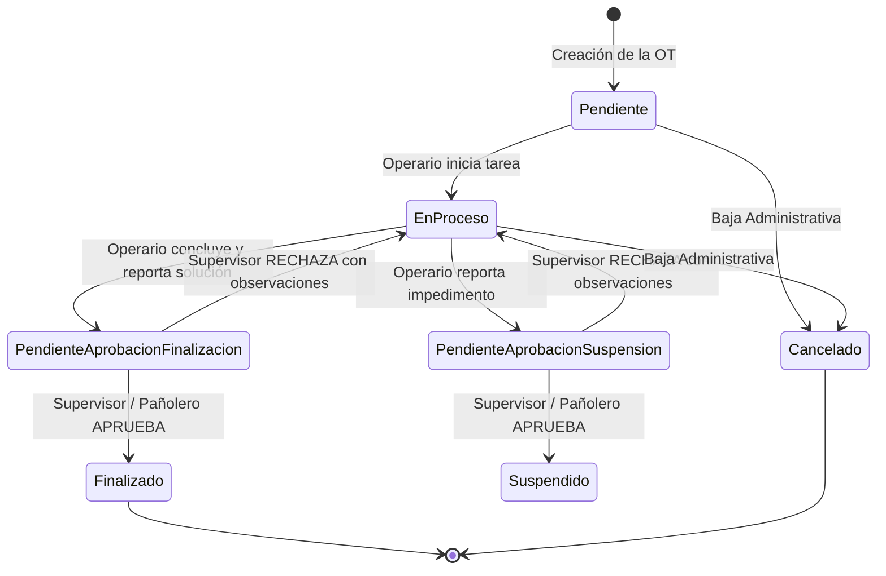
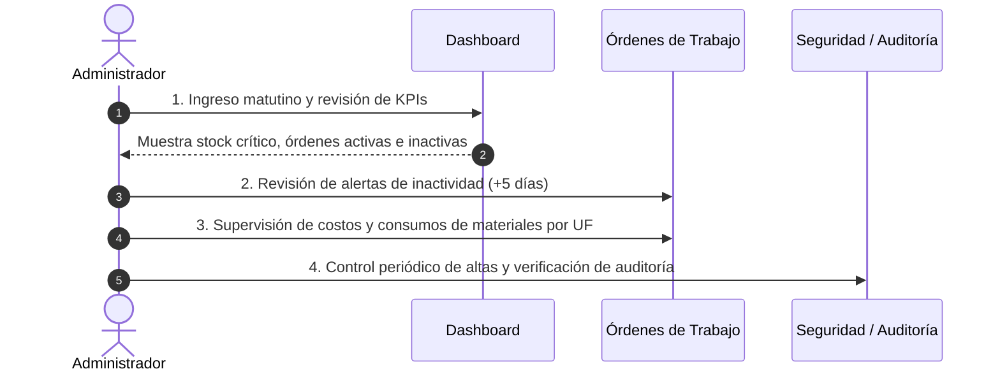
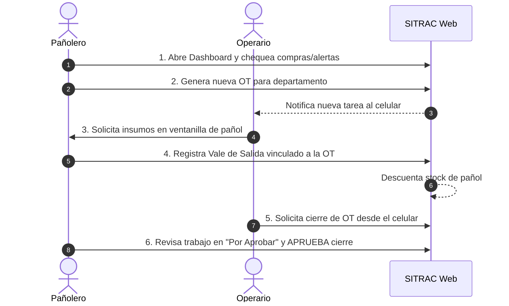
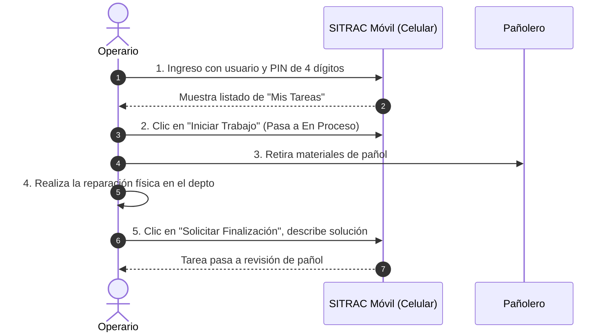

# SITRAC / SIPAC — Manual de Usuario Oficial del Sistema
### Sistema Integral de Trabajos y Abastecimiento para Consorcios

---

## Tabla de Contenidos
1. [Introducción y Objetivos del Sistema](#1-introducción-y-objetivos-del-sistema)
   - 1.1 [Propósito](#11-propósito)
   - 1.2 [Conceptos y Glosario Fundamental](#12-conceptos-y-glosario-fundamental)
2. [Arquitectura de Usuarios y Matriz de Roles](#2-arquitectura-de-usuarios-y-matriz-de-roles)
   - 2.1 [Perfiles de Usuario](#21-perfiles-de-usuario)
   - 2.2 [Matriz de Permisos por Rol](#22-matriz-de-permisos-por-rol)
3. [Acceso al Sistema y Autenticación](#3-acceso-al-sistema-y-autenticación)
   - 3.1 [Ingreso al Panel Web de Gestión (`/login`)](#31-ingreso-al-panel-web-de-gestión-login)
   - 3.2 [Ingreso al Portal Móvil de Operarios (`/login-operario`)](#32-ingreso-al-portal-móvil-de-operarios-login-operario)
   - 3.3 [Activación y Configuración del PIN Móvil (`/activar-pin`)](#33-activación-y-configuración-del-pin-móvil-activar-pin)
   - 3.4 [Cierre de Sesión y Seguridad](#34-cierre-de-sesión-y-seguridad)
4. [Instructivo Detallado Módulo por Módulo](#4-instructivo-detallado-módulo-por-módulo)
   - 4.1 [Panel de Control (Dashboard)](#41-panel-de-control-dashboard)
   - 4.2 [Pañol / Artículos e Inventario](#42-pañol--artículos-e-inventario)
   - 4.3 [Salidas y Egresos de Materiales (Vales de Consumo)](#43-salidas-y-egresos-de-materiales-vales-de-consumo)
   - 4.4 [Compras y Recepción de Mercadería](#44-compras-y-recepción-de-mercadería)
   - 4.5 [Órdenes de Trabajo (OT) y Mantenimiento](#45-órdenes-de-trabajo-ot-y-mantenimiento)
   - 4.6 [Ajustes de Inventario (Recuentos y Mermas)](#46-ajustes-de-inventario-recuentos-y-mermas)
   - 4.7 [Personal Técnico / Empleados y Acceso Móvil](#47-personal-técnico--empleados-y-acceso-móvil)
   - 4.8 [Categorías de Pañol y Rubros de Trabajo](#48-categorías-de-pañol-y-rubros-de-trabajo)
   - 4.9 [Seguridad y Cuentas de Usuario (Exclusivo Administrador)](#49-seguridad-y-cuentas-de-usuario-exclusivo-administrador)
   - 4.10 [Auditoría y Registro de Trazabilidad (Exclusivo Administrador)](#410-auditoría-y-registro-de-trazabilidad-exclusivo-administrador)
   - 4.11 [Portal Móvil de Autoservicio para Operarios (PWA)](#411-portal-móvil-de-autoservicio-para-operarios-pwa)
5. [Guías Operativas Paso a Paso por Rol](#5-guías-operativas-paso-a-paso-por-rol)
   - 5.1 [Guía Diaria del Administrador](#51-guía-diaria-del-administrador)
   - 5.2 [Guía Diaria del Pañolero / Encargado de Mantenimiento](#52-guía-diaria-del-pañolero--encargado-de-mantenimiento)
   - 5.3 [Guía Diaria del Operario / Técnico de Campo](#53-guía-diaria-del-operario--técnico-de-campo)
6. [Preguntas Frecuentes (FAQ) y Manejo de Contingencias](#6-preguntas-frecuentes-faq-y-manejo-de-contingencias)

---

## 1. Introducción y Objetivos del Sistema

### 1.1 Propósito
**SITRAC / SIPAC** (*Sistema Integral de Trabajos y Abastecimiento para Consorcios*) es una plataforma integral diseñada para centralizar, controlar y transparentar la gestión operativa de edificios, torres y complejos habitacionales o comerciales.

El sistema resuelve dos necesidades críticas de forma coordinada:
1. **Control de Abastecimiento y Pañol**: Registro exhaustivo de compras de insumos, stock disponible en tiempo real, alertas de reposición y trazabilidad de materiales entregados.
2. **Gestión de Órdenes de Trabajo (OT)**: Registro y seguimiento de incidentes de mantenimiento, asignación de tareas a personal técnico, bitácora de intervenciones por departamento o sector, y vinculación directa de los materiales utilizados con la orden de trabajo correspondiente.

### 1.2 Conceptos y Glosario Fundamental

| Término | Definición y Alcance dentro del Sistema |
|---|---|
| **Unidad Funcional (UF)** | Ubicación física específica dentro del consorcio (e.g., *Torre A - Piso 4 - Depto B*, *Local Comercial 12*, o *Sector Común - Sala de Bombas*). |
| **Pañol** | Almacén central de repuestos, herramientas, materiales eléctricos, de plomería, pintura y limpieza del consorcio. |
| **Stock Crítico** | Condición en la cual la cantidad física de un material en pañol es menor o igual a su **Stock Mínimo** parametrizado. |
| **Artículo Fraccionable** | Material que admite consumos o ingresos con cifras decimales (e.g., *2.5 metros de cable*, *0.75 litros de solvente*). Si no es fraccionable, el sistema restringe estrictamente el uso a números enteros (e.g., *1 lámpara*, *2 llaves térmicas*). |
| **Orden de Trabajo (OT)** | Registro formal de una tarea de reparación, mantenimiento o inspección técnica solicitada o ejecutada en una Unidad Funcional. |
| **Vale de Salida / Egreso** | Registro de entrega de materiales del pañol a un técnico. En SITRAC, **todo egreso debe estar estrictamente asociado a una OT activa**. |
| **Baja Lógica** | Cancelación de un registro (artículo u orden) sin eliminarlo de la base de datos para preservar el historial contable y la trazabilidad de auditoría. |
| **Baja Física** | Eliminación permanente de un registro erróneo. Solo permitida en Órdenes de Trabajo que no tengan consumos ni movimientos de bitácora. |

---

## 2. Arquitectura de Usuarios y Matriz de Roles

### 2.1 Perfiles de Usuario

El sistema clasifica a los usuarios en tres roles funcionales principales:

1. **Administrador (`Admin`)**: 
   - Responsable general del consorcio, administración informática y gobernanza.
   - Posee control total sobre la parametrización, altas y bajas de cuentas, auditoría forense de cambios y supervisión de costos.
2. **Pañolero / Encargado de Mantenimiento (`Pañolero`)**:
   - Responsable de la guardia física del almacén y la logística de mantenimiento.
   - Recibe compras de proveedores, custodia el stock, entrega materiales a los técnicos, crea órdenes de trabajo y aprueba formalmente las tareas concluidas.
3. **Operario / Técnico de Mantenimiento (`Operario`)**:
   - Personal técnico operativo en terreno (electricistas, plomeros, albañiles, pintores, cerrajeros).
   - Accede a través de su teléfono móvil o tablet al Portal Operario táctil mediante un PIN de 4 dígitos. Consulta tareas asignadas, inicia trabajos, reporta soluciones y solicita cierres o suspensiones.

### 2.2 Matriz de Permisos por Rol

| Módulo / Funcionalidad | Administrador (`Admin`) | Pañolero (`Pañolero`) | Operario (`Operario`) |
|---|:---:|:---:|:---:|
| **Acceso a Panel Web Principal** | Sí | Sí | No (Redirige a portal móvil) |
| **Dashboard y KPIs Globales** | Lectura Total | Lectura Total | No |
| **Gestión de Artículos (Pañol)** | Alta, Edición, Activar/Desactivar | Alta, Edición, Activar/Desactivar | Solo lectura de disponibles |
| **Salidas / Egresos de Pañol** | Registro y Consulta | Registro y Consulta | Consulta en sus OTs |
| **Compras / Recepción Facturas** | Registro y Consulta | Registro y Consulta | No |
| **Crear y Modificar OTs** | Sí | Sí | No |
| **Aprobar / Rechazar Cierres de OTs** | Sí | Sí | No |
| **Portal Móvil de Autoservicio** | Modo auditoría | Modo auditoría | **Uso Principal (PIN 4 Dígitos)** |
| **Iniciar Tarea y Reportar Solución** | Sí | Sí | **Sí (desde el portal móvil)** |
| **Ajustes de Inventario (Recuentos)** | Registro y Consulta | Registro y Consulta | No |
| **Gestión de Personal Técnico** | Alta, Edición, Activar Móvil | Alta, Edición, Activar Móvil | Consulta propia |
| **Categorías y Rubros** | Crear, Editar, Eliminar | Crear, Editar, Eliminar | Solo lectura |
| **Gestión de Cuentas y Accesos (`/seguridad`)** | **Exclusivo (Crear, Editar, Claves)** | Bloqueado | Bloqueado |
| **Auditoría de Cambios (`/auditoria`)** | **Exclusivo (Trazabilidad Diffs)** | Bloqueado | Bloqueado |

---

## 3. Acceso al Sistema y Autenticación

SITRAC cuenta con dos vías de acceso diseñadas según el dispositivo y rol del usuario:

```
                  ┌──────────────────────────────┐
                  │    URL del Sistema SITRAC    │
                  └──────────────┬───────────────┘
                                 │
         ┌───────────────────────┴───────────────────────┐
         ▼                                               ▼
┌──────────────────────────────┐       ┌──────────────────────────────┐
│  Portal Web de Gestión       │       │  Portal Móvil Operarios      │
│  Ruta: /login                │       │  Ruta: /login-operario       │
│  Destinado a:                │       │  Destinado a:                │
│  • Administradores           │       │  • Técnicos de Campo         │
│  • Pañoleros / Supervisores  │       │  • Mantenimiento Operativo   │
│  Credenciales:               │       │  Credenciales:               │
│  • Nombre de Usuario         │       │  • Nombre de Usuario         │
│  • Contraseña Alfanumérica   │       │  • PIN Numérico de 4 Dígitos │
└──────────────────────────────┘       └──────────────────────────────┘
```

### 3.1 Ingreso al Panel Web de Gestión (`/login`)
1. Ingrese a la dirección web del sistema en su navegador (Google Chrome, Microsoft Edge, Firefox, Safari).
2. Se presentará el formulario **Acceso al Sistema**.
3. Ingrese su **Nombre de Usuario** (e.g., `admin` o `panolero`).
4. Ingrese su **Contraseña**.
5. Presione el botón **Iniciar Sesión**.
6. En caso de éxito, el sistema almacenará de forma segura su token de sesión (JWT) y lo redirigirá al **Dashboard** principal.

> [!NOTE]
> Si una cuenta de rol `Operario` intenta ingresar por `/login`, el sistema detectará automáticamente su rol y lo redirigirá al **Portal Móvil** (`/operario`).

### 3.2 Ingreso al Portal Móvil de Operarios (`/login-operario`)
Diseñado especialmente para la pantalla táctil de teléfonos celulares:
1. Ingrese a la ruta `/login-operario` (o seleccione el enlace en el pie de la pantalla de login tradicional).
2. Ingrese su **Nombre de Usuario** asignado (e.g., `cgomez` o `silvio`).
3. En la cuadrícula de 4 casillas numéricas, digite su **PIN de 4 dígitos**. El cursor avanzará automáticamente entre casillas.
4. Si desea verificar los números tipeados, presione el botón **Ver** (ícono de ojo).
5. Presione **Ingresar a mis Tareas**.

### 3.3 Activación y Configuración del PIN Móvil (`/activar-pin`)
Cuando el Administrador o Pañolero da de alta un técnico y le habilita el acceso móvil, se genera un enlace de activación seguro:
1. El operario recibe el enlace por correo electrónico o por mensaje (e.g., `https://tu-sitrac.com/activar-pin?token=3f8a...`).
2. Al pulsar el enlace, el sistema valida la vigencia del token (validez de 48 horas).
3. Se muestra el nombre del técnico y su usuario asignado.
4. El operario debe tipear un **PIN nuevo de 4 dígitos** y confirmarlo en la segunda cuadrícula.
5. Al pulsar **Establecer y Activar PIN**, el acceso queda configurado inmediatamente y se redirige a la pantalla de ingreso.

### 3.4 Cierre de Sesión y Seguridad
- Para cerrar sesión en la versión de escritorio, haga clic en el botón **Cerrar Sesión** ubicado al pie de la barra lateral izquierda.
- En la versión móvil, pulse el ícono de salida situado en el encabezado superior derecho.
- Los tokens de sesión vencen periódicamente de forma automática para evitar accesos no autorizados en terminales compartidas.

---

## 4. Instructivo Detallado Módulo por Módulo

---

### 4.1 Panel de Control (Dashboard)

El **Dashboard** (`/dashboard`) es el centro de mando operativo del consorcio. Proporciona visibilidad en tiempo real del estado de los insumos y las actividades de mantenimiento.

```
┌─────────────────────────────────────────────────────────────────────────────┐
│ DASHBOARD: [Artículos: 142] [Stock Crítico: 3] [OTs Activas: 8] [Alertas: 1]│
├─────────────────────────────────────────────────────────────────────────────┤
│ ACCIONES RÁPIDAS:  [+ Registrar Salida]  [+ Registrar Compra]  [+ Nueva OT] │
├──────────────────────────────────────┬──────────────────────────────────────┤
│ ⚠️  TABLA DE MATERIALES EN STOCK      │ 📋 ÓRDENES DE TRABAJO RECIENTES      │
│     CRÍTICO O NULO                   │    • OT-2026-0012 (Torre A - 4° B)   │
│     • Cinta Aisladora (Stock: 1)     │      Estado: En Proceso              │
│     • Llave Térmica 16A (Stock: 0)   │    • OT-2026-0011 (Local 4)          │
│                                      │      Estado: Por Aprobar             │
└──────────────────────────────────────┴──────────────────────────────────────┘
```

#### Elementos Principales:
1. **Píldoras de Métricas (KPIs)**:
   - **Artículos**: Total de materiales registrados en el catálogo de pañol.
   - **Stock Crítico**: Cantidad de materiales cuya existencia física es igual o menor a su stock mínimo de seguridad.
   - **OTs Activas**: Cantidad de órdenes que se encuentran actualmente en curso (*Pendiente*, *En Proceso* o *En Aprobación*).
   - **Por Aprobar**: Cantidad de trabajos que los operarios ya marcaron como finalizados o suspendidos y que aguardan la inspección y aprobación del pañolero/administrador.
   - **+5 Días Inactiva**: Contador de órdenes activas que llevan más de 5 días corridos sin que se registre ninguna actualización técnica o consumo de materiales.
2. **Botones de Acción Rápida**:
   - Acceso inmediato en 1 clic para registrar Salidas, Compras o emitir una Nueva Orden de Trabajo.
3. **Tabla de Stock Crítico**:
   - Muestra el artículo, su categoría, la cantidad actual restante y el stock mínimo exigido.
   - Si el stock es `0`, el indicador se colorea en rojo (*Sin Stock*); si es menor al umbral mínimo, se muestra en amarillo (*Stock Bajo*).
4. **Resumen de Egresos y Órdenes Recientes**:
   - Visualización cronológica de las últimas entregas de materiales y el estado de las últimas órdenes ingresadas.

---

### 4.2 Pañol / Artículos e Inventario

El módulo **Pañol / Artículos** (`/articulos`) permite administrar el catálogo de insumos, materiales de reposición, herramientas y equipamiento técnico.

#### 4.2.1 Catálogo y Búsqueda
- **Barra de Búsqueda**: Permite buscar artículos tipeando su nombre o palabras clave.
- **Filtro por Categoría**: Despliega un selector con las categorías configuradas (Electricidad, Plomería, Ferretería, Pintura, etc.).
- **Filtro "Solo Críticos"**: Casilla de verificación para listar exclusivamente aquellos materiales que requieren reposición urgente.

#### 4.2.2 Alta de un Nuevo Artículo
1. Presione el botón **+ Nuevo Artículo**.
2. Complete el formulario modal:
   - **Nombre del Artículo**: Denominación clara y precisa (e.g., *Llave de paso esférica 1/2"*).
   - **Categoría**: Seleccione la familia a la que pertenece el material.
   - **Unidad de Medida**: Seleccione entre *Unidad*, *Metro*, *Litro*, *Kilogramo*, *Rollo*, *Caja*, *Par*, etc.
   - **Artículo Fraccionable**:
     - *Desmarcado (No fraccionable)*: El artículo solo se puede comprar, entregar o ajustar en números enteros (1, 2, 5).
     - *Marcado (Fraccionable)*: Permite ingresar y descontar cantidades decimales (e.g., 0.5 metros, 1.25 litros).
   - **Stock Inicial**: Cantidad física con la que inicia el artículo al momento de su carga original.
   - **Stock Mínimo de Alerta**: Nivel umbral que, al ser alcanzado o superado hacia abajo, encenderá las alertas del Dashboard.
3. Presione **Crear Artículo**.

> [!IMPORTANT]
> **Principio de Trazabilidad**: En la edición de un artículo existente **no es posible modificar directamente la cantidad en stock**. El saldo de un material solo puede aumentar mediante una **Compra / Ingreso** o un **Ajuste de Inventario**, y solo puede disminuir mediante una **Salida imputada a una OT** o un **Ajuste de Baja justificado**. De esta manera se garantiza que no existan alteraciones de inventario anónimas o sin comprobante.

#### 4.2.3 Modificación y Desactivación de Artículos
- **Editar Ficha**: Presione el ícono de lápiz en la fila del artículo para actualizar el nombre, categoría, unidad de medida o stock mínimo.
- **Activar / Desactivar**: Presione el ícono de encendido/apagado. Desactivar un material lo oculta de las nuevas salidas y compras, pero preserva intacto todo el historial de consumos de meses anteriores.

---

### 4.3 Salidas y Egresos de Materiales (Vales de Consumo)

El módulo **Salidas / Egresos** (`/salidas`) es la pasarela donde se documenta formalmente la entrega de herramientas consumibles e insumos a los técnicos de mantenimiento.

```
┌─────────────────────────────────────────────────────────────────────────────┐
│ CIRCUITO ESTRICTO DE SALIDA DE MATERIALES:                                  │
│                                                                             │
│ [Stock en Pañol] ──(Resta Stock)──► [Vale de Egreso] ──► [Orden de Trabajo] │
│                                             │                     │         │
│                                    Registra Técnico       Imputa Costo y UF │
└─────────────────────────────────────────────────────────────────────────────┘
```

#### Reglas de Negocio Críticas:
1. **Imputación Obligatoria a OT**: Todo egreso debe estar asociado a una **Orden de Trabajo activa** (*Pendiente* o *En Proceso*). No se permite la salida libre de materiales sin un trabajo formal asignado.
2. **Validación de Saldo en Pañol**: El sistema rechaza cualquier salida si la cantidad solicitada supera el stock disponible en pañol.
3. **Control de Fraccionamiento**: Si el artículo es indivisible (e.g., *Cerradura de pomo*), el sistema impide ingresar decimales o símbolos no numéricos.

#### Paso a Paso para Registrar una Salida:
1. Presione el botón **+ Registrar Salida** (en `/salidas` o desde el Dashboard).
2. Seleccione el **Artículo** a entregar. El sistema indicará inmediatamente en pantalla el stock disponible y la unidad de medida.
3. Seleccione la **Orden de Trabajo**. El menú desplegable muestra el número de OT, la Unidad Funcional de destino y el problema a resolver.
4. Ingrese la **Cantidad a entregar**.
5. Ingrese **Observaciones** (opcional, e.g., *Entrega de repuesto adicional por rotura de pieza original*).
6. Presione **Confirmar Salida**:
   - El sistema descuenta inmediatamente el material del pañol.
   - El consumo queda registrado en la bitácora de la Orden de Trabajo.
   - Queda asentado el usuario autenticado (pañolero) que autorizó la entrega junto con la fecha y hora exacta.

---

### 4.4 Compras y Recepción de Mercadería

El módulo **Compras / Ingresos** (`/compras`) permite asentar formalmente la llegada de mercadería provista por distribuidores, ferreterías y corralones.

#### Paso a Paso para Registrar una Compra:
1. Ingrese a **Compras / Ingresos** y presione **+ Registrar Ingreso / Compra**.
2. Complete los datos de cabecera:
   - **N° de Factura / Remito**: Identificador alfanumérico del comprobante legal o comercial (e.g., `FC-A-0001-00084729` o `REM-1423`).
   - **Fecha de Recepción**: Fecha en que los bultos ingresaron físicamente a pañol.
   - **Observaciones / Diferencias**: Notas aclaratorias (e.g., *Bulto 2 con caja abierta; faltó 1 caja de tornillos que será enviada mañana*).
3. **Carga de Artículos (Detalle de Compra)**:
   - Seleccione el artículo recibido de la lista.
   - Ingrese la **Cantidad Recibida**.
   - Para agregar más renglones de la misma factura, presione **+ Agregar otro artículo**.
   - Para remover un renglón, presione el ícono de cesto de basura.
4. Presione **Guardar Ingreso de Mercadería**:
   - Los artículos cargados incrementan su saldo en pañol de forma automática y simultánea.
   - Se crea el comprobante de compra con respaldo auditable.

---

### 4.5 Órdenes de Trabajo (OT) y Mantenimiento

El módulo **Órdenes de Trabajo** (`/ordenes`) es el núcleo operativo de SITRAC. Administra desde el reporte inicial de un desperfecto hasta el cierre verificado de la reparación.

#### 4.5.1 Ciclo de Vida y Estados de una OT



#### 4.5.2 Alta de una Nueva Orden de Trabajo (Flujo en Cascada)
1. Presione **+ Nueva Orden de Trabajo**.
2. **Selección de la Unidad Funcional (en 3 pasos)**:
   - **Paso A - Sector / Torre**: Seleccione entre *Torre A*, *Torre B*, *Locales Comerciales* o *Sectores Comunes*.
   - **Paso B - Piso**: Seleccione el nivel o piso correspondiente.
   - **Paso C - Departamento / Local**: Seleccione la unidad funcional exacta (e.g., *Piso 5 - Depto C*).
3. **Asignación Técnica**:
   - **Responsable Asignado**: Seleccione el técnico o cuadrilla responsable del trabajo (e.g., *Claudio*, *Silvio*).
   - **Rubro de Trabajo**: Seleccione la categoría del oficio (*Electricidad*, *Plomería*, *Gas*, *Albañilería*, *Cerrajería*, etc.).
4. **Descripción del Incidente**:
   - **Problema Reportado**: Describa claramente el fallo o requerimiento reportado por el propietario o consorcio.
   - **Observaciones Iniciales**: Indicaciones especiales (e.g., *Coordinar acceso con la inquilina después de las 14:00 hs*).
5. Presione **Crear Orden de Trabajo**:
   - La orden se genera con un número correlativo único.
   - Si el operario tiene configurada la aplicación móvil, recibirá de inmediato una **notificación push** sonora en su teléfono.

#### 4.5.3 Bandeja de Aprobaciones Técnicas
Cuando un técnico concluye un trabajo o no puede continuarlo, la orden pasa a un estado de revisión. En la parte superior de `/ordenes` o filtrando por estado, se destacan las órdenes en:
- `Pendiente Aprobacion Finalizacion`: El operario indicó qué solución aplicó y solicita cerrar la orden.
- `Pendiente Aprobacion Suspension`: El operario reportó que falta un repuesto o requiere autorización del consorcio.

**Acciones del Supervisor / Pañolero:**
- **Aprobar**: Verifica la conformidad de la tarea y presiona **Aprobar Finalización** o **Aprobar Suspensión**. La OT se cierra formalmente.
- **Rechazar**: Si la tarea está incompleta, presiona **Rechazar**, escribe las correcciones requeridas y la orden regresa a `En Proceso` para que el operario subsane lo solicitado.

#### 4.5.4 Alerta de Inactividad (+5 Días)
Las órdenes de trabajo no pueden quedar olvidadas. Toda orden activa que transcurra más de 5 días seguidos sin registrar consumos ni cambios de estado:
- Enciende un **borde rojo y badge de alerta** en la lista de órdenes.
- Suma un punto al indicador numérico **+5 Días Inactiva** del Dashboard.
- Permite al encargado tomar contacto inmediato con el técnico asignado para destrabar la situación.

#### 4.5.5 Historial de Intervenciones por Unidad Funcional
Al inspeccionar una orden, presione el botón **Historial UF**. El sistema abrirá una ventana con todas las reparaciones históricas realizadas en ese mismo departamento a lo largo del tiempo, detallando fechas, problemas anteriores y materiales que se usaron en el pasado.

#### 4.5.6 Baja Lógica vs. Baja Física
- **Baja Física**: Si una orden se creó por error tipográfico y **no tiene salidas de material ni bitácora registrada**, el sistema permite eliminarla físicamente.
- **Baja Lógica**: Si la orden **ya tiene materiales entregados desde el pañol**, no puede ser destruida. El sistema la marca como `Cancelada` y bloquea nuevas salidas, preservando intacto el registro contable de los materiales consumidos.

#### 4.5.7 Exportación a PDF de la Orden de Trabajo
Cada orden cuenta con un botón **Exportar / Descargar PDF**. Genera un documento formal con membrete del consorcio, datos de la unidad funcional, técnico responsable, fecha, problema, solución aplicada, detalle de materiales consumidos con sus cantidades y campos para la firma de conformidad del propietario o encargado.

---

### 4.6 Ajustes de Inventario (Recuentos y Mermas)

El módulo **Ajustes de Stock** (`/ajustes`) resuelve cualquier discrepancia entre la existencia física en estantería y el saldo registrado en el sistema informático.

#### Modalidades de Ajuste:
1. **Recuento Físico (Inventario Ciego)**:
   - Se realiza un conteo manual de la estantería y se ingresa la cantidad exacta encontrada (e.g., hay 14 unidades físicas).
   - El sistema calcula automáticamente la diferencia (positiva o negativa) y actualiza el stock final al valor recontado.
2. **Alta Directa**:
   - Suma una cantidad fija al stock (e.g., hallazgo de material previamente extraviado).
3. **Baja Directa**:
   - Descuenta una cantidad del stock por motivos justificados ajenos a una OT (rotura de una herramienta, descarte de pintura seca o vencida, robo o deterioro por humedad).

#### Requisitos Obligatorios:
- **Motivo**: Selección de categoría de ajuste (*Recuento de inventario físico*, *Rotura o daño de material*, *Material vencido / en desuso*, *Error administrativo previo*).
- **Justificación**: Campo de texto amplio y obligatorio donde el responsable debe detallar el motivo puntual de la modificación física.

---

### 4.7 Personal Técnico / Empleados y Acceso Móvil

El módulo **Personal** (`/empleados`) gestiona a los técnicos y operarios que ejecutan el mantenimiento físico en los edificios.

#### 4.7.1 Alta de Técnico
1. Presione **+ Registrar Empleado**.
2. Complete:
   - **Nombre Completo** (e.g., *Claudio Gómez*).
   - **Legajo** (e.g., *LEG-015*).
   - **Puesto / Sector** (e.g., *Técnico Electricista - Mantenimiento General*).
3. Presione **Guardar**.

#### 4.7.2 Habilitación de Acceso Móvil (Autoservicio con PIN)
Para que un técnico pueda usar el portal móvil en su teléfono:
1. En la lista de empleados, localice al técnico y presione el botón **Habilitar Acceso Móvil** (ícono de smartphone).
2. Ingrese el **Correo Electrónico** del técnico.
3. Presione **Habilitar y Generar Token**:
   - El sistema genera automáticamente un nombre de usuario unificado en minúsculas (e.g., `cgomez`).
   - Genera un token criptográfico único con validez de 48 horas.
   - Si el servidor de correos está configurado, envía un email automático de bienvenida con el enlace de activación.
   - Si prefiere enviarlo manualmente por WhatsApp, el sistema muestra en pantalla el botón **Copiar Enlace de Activación** para compartirlo al instante.

---

### 4.8 Categorías de Pañol y Rubros de Trabajo

El módulo **Categorías** (`/categorias`) cuenta con dos pestañas de configuración:

#### Pestaña 1: Categorías de Artículos (Pañol)
- Clasifica los materiales según su naturaleza (e.g., *Herramientas Manuales*, *Electricidad e Iluminación*, *Plomería y Gas*, *Ferretería y Tornillería*, *Pinturas y Adhesivos*, *Seguridad e Higiene - EPP*).
- **Control de Borrado Seguro**: El sistema prohíbe eliminar una categoría si existen artículos registrados dentro de ella, protegiendo la integridad referencial.

#### Pestaña 2: Rubros de Trabajo (Órdenes de Trabajo)
- Define las especialidades técnicas de las órdenes (*Electricidad*, *Plomería*, *Albañilería*, *Ascensores*, *Cerrajería*, *Herrería*, *Limpieza y Desinfección*).
- Permite activar o desactivar rubros temporalmente según los convenios y personal disponible.

---

### 4.9 Seguridad y Cuentas de Usuario (Exclusivo Administrador)

El módulo **Seguridad** (`/seguridad`) está restringido exclusivamente a usuarios con rol `Admin`.

#### Funcionalidades:
1. **Padrón de Usuarios del Sistema Web**:
   - Visualización de todas las cuentas creadas, con indicación de su rol (`Admin`, `Pañolero`, `Supervisor`) y estado (`Activo` / `Inactivo`).
2. **Creación de Nuevos Usuarios**:
   - Permite crear nuevos operadores ingresando Nombre, Usuario, Contraseña y asignando el Rol correspondiente.
3. **Reseteo Directo de Contraseña**:
   - Si un pañolero u operador olvida su contraseña, el Administrador puede ingresar al ícono de llave y fijar una nueva clave sin necesidad de confirmación previa.
4. **Mecanismo Antiautobloqueo (Resguardo Crítico)**:
   - El sistema analiza activamente la base de usuarios: **está estrictamente prohibido desactivar, cambiar de rol o eliminar al último Administrador activo del sistema**. Esto impide que el consorcio quede sin acceso administrativo por error operativo.

---

### 4.10 Auditoría y Registro de Trazabilidad (Exclusivo Administrador)

El módulo **Auditoría** (`/auditoria`) es un libro de registro contable y técnico inmutable. Registra cualquier acción de alta, modificación o baja ejecutada en la base de datos.

#### Qué información documenta cada registro:
- **Fecha y Hora Exacta**.
- **Usuario Responsable**: Nombre y usuario que realizó la acción.
- **Entidad Afectada**: Si fue sobre un Artículo, Orden de Trabajo, Compra, Egreso, Ajuste o Usuario.
- **Tipo de Acción**: `Alta (Added)`, `Modificación (Modified)` o `Eliminación (Deleted)`.
- **Comparador Visual de Cambios (Diff Interactivo)**:
  - Al expandir un registro de modificación, el sistema muestra una tabla comparativa con dos columnas: **Valor Anterior** y **Valor Nuevo**.
  - Permite saber exactamente qué campo cambió (e.g., *el Stock Mínimo cambió de 5 a 10*, o *el Estado de la OT pasó de 'En Proceso' a 'Finalizado'*).

---

### 4.11 Portal Móvil de Autoservicio para Operarios (PWA)

El **Portal Operario** (`/operario`) está optimizado para su uso en teléfonos inteligentes Android e iOS. Puede agregarse a la pantalla de inicio del teléfono como una aplicación nativa (PWA).

```
┌───────────────────────────────────────────────┐
│ 🟢 SITRAC MÓVIL           Claudio Gómez [Salir]│
├───────────────────────────────────────────────┤
│ [🔔 Push Activo]           (•) En Línea       │
├───────────────────────┬───────────────────────┤
│     MIS TAREAS (3)    │      HISTORIAL        │
├───────────────────────┴───────────────────────┤
│ 📋 OT-2026-0012                  [⚡ Pendiente]│
│ 📍 Torre A - 4° Piso - Depto B                │
│ ⚠️ Reparar pérdida de agua en bajo mesada     │
│                                               │
│ [ ▶ Iniciar Trabajo ]   [ 📄 Descargar PDF ]   │
│ [ ℹ️ Ver Detalle y Materiales ]               │
├───────────────────────────────────────────────┤
│ 📋 OT-2026-0009                 [🛠️ En Proceso]│
│ 📍 Local 3 - Galería                          │
│ ⚠️ Cambio de tubo LED titilando               │
│                                               │
│ [ ✔ Solicitar Finalización ]                  │
│ [ ⏸ Solicitar Suspensión ]                    │
└───────────────────────────────────────────────┘
```

#### Capacidades Principales:
1. **Modo Conectado / Offline**:
   - Posee un semáforo de conectividad: `🟢 En línea` o `🔴 Modo offline`.
   - Si el técnico baja al subsuelo o a una sala de máquinas sin señal de telefonía, el portal continúa operativo para consultar las instrucciones de las tareas cargadas previamente.
2. **Notificaciones Push y Alertas Sonoras**:
   - Al pulsar la campana de notificaciones, el teléfono solicita permiso para enviar notificaciones web.
   - Cuando pañol le asigne una nueva tarea, el teléfono emitirá un tono de aviso y desplegará la alerta en la barra de notificaciones del celular.
3. **Flujo de Ejecución de Tareas**:
   - **Iniciar Trabajo**: Pulsa el botón verde **Iniciar Trabajo**. La orden cambia inmediatamente a `En Proceso`, avisando a la administración que la reparación comenzó.
   - **Consultar Materiales Imputados**: Al ingresar a **Ver Detalle**, el técnico puede revisar exactamente qué materiales le despachó el pañolero para ese trabajo.
   - **Solicitar Finalización**: Al culminar, pulsa **Solicitar Finalización**, escribe qué solución aplicó (e.g., *Se reemplazó flexible de 1/2" y teflón en bajo mesada. Sin pérdidas.*) y envía la solicitud.
   - **Solicitar Suspensión**: Si se encuentra con un impedimento mayor, pulsa **Solicitar Suspensión**, selecciona el motivo (e.g., *Se requiere cortar el suministro general de la columna*) y lo envía al encargado.
4. **Descarga de PDF Directa**:
   - Permite generar y mostrar en el celular la orden en PDF para exhibirla ante el encargado del edificio o el propietario de la unidad funcional.

---

## 5. Guías Operativas Paso a Paso por Rol

---

### 5.1 Guía Diaria del Administrador



#### Rutina de Trabajo del Administrador:
1. **Comienzo del Día - Monitoreo de KPIs**:
   - Ingrese con sus credenciales al panel web (`/dashboard`).
   - Compruebe el contador de **Stock Crítico**: si hay materiales en cero, coordine la emisión de órdenes de compra con los proveedores habituales.
   - Revise el contador de **+5 Días Inactiva**: identifique qué órdenes se encuentran detenidas y converse con el encargado de mantenimiento para resolver bloqueos.
2. **Gestión de Cuentas y Accesos**:
   - Cuando ingrese un nuevo empleado técnico, verifique en `/empleados` que se le haya creado el acceso móvil.
   - Para nuevos miembros administrativos o de auditoría, ingrese a `/seguridad` y cree la cuenta correspondiente con el rol pertinente.
3. **Control y Auditoría Forense**:
   - Una vez por semana, ingrese al módulo `/auditoria`.
   - Filtre por acciones de tipo `Deleted` o ajustes de inventario de gran volumen para verificar que todas las mermas cuenten con la debida justificación.

---

### 5.2 Guía Diaria del Pañolero / Encargado de Mantenimiento



#### Rutina de Trabajo del Pañolero:
1. **Apertura de Pañol y Revisión de Stock**:
   - Revise la tabla de **Materiales con Stock Bajo o Nulo** en el Dashboard para prever los requerimientos de la jornada.
2. **Generación y Asignación de Órdenes de Trabajo**:
   - Ante la llamada de un vecino o requerimiento de la administración, ingrese a `/ordenes` y pulse **+ Nueva OT**.
   - Identifique la torre, piso y depto.
   - Asigne el técnico según especialidad (electricidad, plomería, etc.).
3. **Despacho de Materiales (Salidas)**:
   - Cuando el técnico se presente en ventanilla a retirar repuestos, abra `/salidas`.
   - Localice la OT del técnico y cargue los artículos entregados.
   - *Nunca entregue materiales sin imputar a una OT activa.*
4. **Recepción de Mercadería (Compras)**:
   - Cuando el transporte o la ferretería entregue un pedido, diríjase a `/compras`.
   - Coteje el remito físico contra lo que ingresa a estantería y cargue las cantidades en el sistema.
5. **Bandeja de Aprobaciones de Fin de Jornada**:
   - Antes de concluir el turno, filtre las órdenes en estado **Por Aprobar**.
   - Corrobore que la solución informada por el técnico sea satisfactoria y concuerde con los materiales que se le entregaron.
   - Presione **Aprobar Finalización**. La orden quedará cerrada formalmente.

---

### 5.3 Guía Diaria del Operario / Técnico de Campo



#### Rutina de Trabajo del Operario:
1. **Ingreso al Turno**:
   - Abra el acceso directo de SITRAC en su teléfono celular (`/login-operario`).
   - Ingrese su usuario y digite su **PIN de 4 dígitos**.
2. **Revisión de Tareas Asignadas**:
   - En la pestaña **Mis Tareas**, consulte las órdenes asignadas.
   - Lea con atención la **Unidad Funcional** (torre, piso, depto) y la descripción del **Problema Reportado**.
3. **Inicio de los Trabajos**:
   - Al llegar al lugar de trabajo, presione el botón **Iniciar Trabajo**. La orden quedará marcada como `En Proceso`.
   - Si requiere materiales, acuda a pañol indicando el número de orden para que le sean entregados.
4. **Cierre o Solicitud de Suspensión**:
   - **Si el trabajo concluyó con éxito**: Presione **Solicitar Finalización**. Escriba un resumen breve de lo que realizó (e.g., *Se desobstruyó desagüe de bacha de cocina y se reemplazó fuelle de goma*). Presione **Enviar**.
   - **Si el trabajo no puede completarse**: Presione **Solicitar Suspensión**, detalle el impedimento (e.g., *El depto se encuentra cerrado / No hay acceso a llave de paso general*) y envíe la solicitud.
5. **Consulta de Histórico Personal**:
   - En la pestaña **Historial**, puede revisar todas las reparaciones ejecutadas anteriormente y descargar los comprobantes en PDF.

---

## 6. Preguntas Frecuentes (FAQ) y Manejo de Contingencias

### ¿Por qué el sistema no me permite registrar una salida de material?
Existen dos motivos posibles:
1. **La Orden de Trabajo no está activa**: El material solo puede entregarse a órdenes en estado `Pendiente` o `En Proceso`. Si la orden ya está finalizada, suspendida o en aprobación, debe reactivarse primero.
2. **Stock insuficiente**: La cantidad solicitada supera las existencias físicas en pañol. El pañolero debe registrar primero un ingreso por compra o un ajuste de stock.

---

### ¿Por qué no puedo ingresar números con coma o decimales al entregar un artículo?
El artículo fue creado con la opción **No Fraccionable** (e.g., *Cerraduras*, *Llaves térmicas*, *Tornillos*). Solo aquellos insumos configurados expresamente como **Fraccionables** (metros de cable, litros de pintura, kilos de yeso) admiten valores decimales.

---

### ¿Qué ocurre si un operario olvida su PIN de 4 dígitos?
El Administrador o Pañolero debe ingresar al módulo de **Personal** (`/empleados`), buscar al técnico y pulsar nuevamente **Habilitar Acceso Móvil**. Esto generará un nuevo enlace de activación que le permitirá al técnico definir un nuevo PIN de 4 dígitos de inmediato.

---

### ¿Qué pasa si el operario se queda sin señal de internet en el subsuelo?
El Portal Móvil de SITRAC es una **PWA con soporte offline**. El técnico podrá seguir visualizando las tareas cargadas previamente en la pantalla. Cuando vuelva a tener conexión WiFi o datos celulares, el sistema sincronizará automáticamente el estado de las órdenes.

---

### ¿Cómo corrijo un error si me equivoqué al cargar un ingreso de compras?
Dado que las compras incrementan el stock oficial, no deben alterarse retroactivamente de forma manual. La corrección se efectúa a través del módulo **Ajustes de Stock** (`/ajustes`), seleccionando el motivo *Error administrativo en ingreso previo*, ajustando el stock al número real y dejando asentada la justificación para el informe de auditoría.

---

### ¿Por qué el sistema me impide eliminar una Orden de Trabajo?
Si la orden **ya tuvo consumo de materiales de pañol**, el sistema bloquea su destrucción física para evitar que se descuadre el inventario contable. En ese caso, la orden solo puede ser dada de **Baja Lógica (Cancelada)**.

---

### ¿Cómo se protegen los accesos ante cambios de personal administrativo?
El módulo de **Seguridad** permite desactivar de inmediato la cuenta de cualquier usuario que deje de pertenecer a la organización. Al marcarlo como inactivo, sus credenciales son invalidadas de forma instantánea en todas las terminales activas.

---

*Manual de Operación de SITRAC / SIPAC — Versión Oficial para Consorcios y Complejos Habitacionales.*

